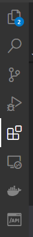
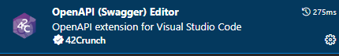
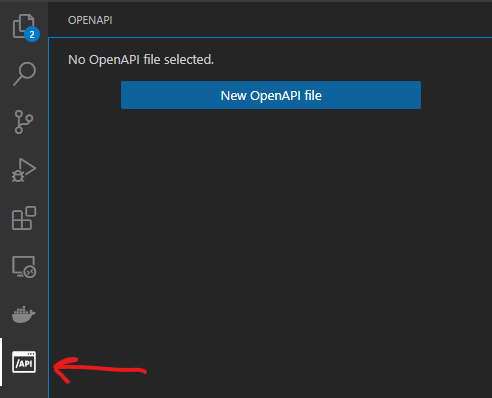
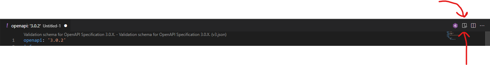
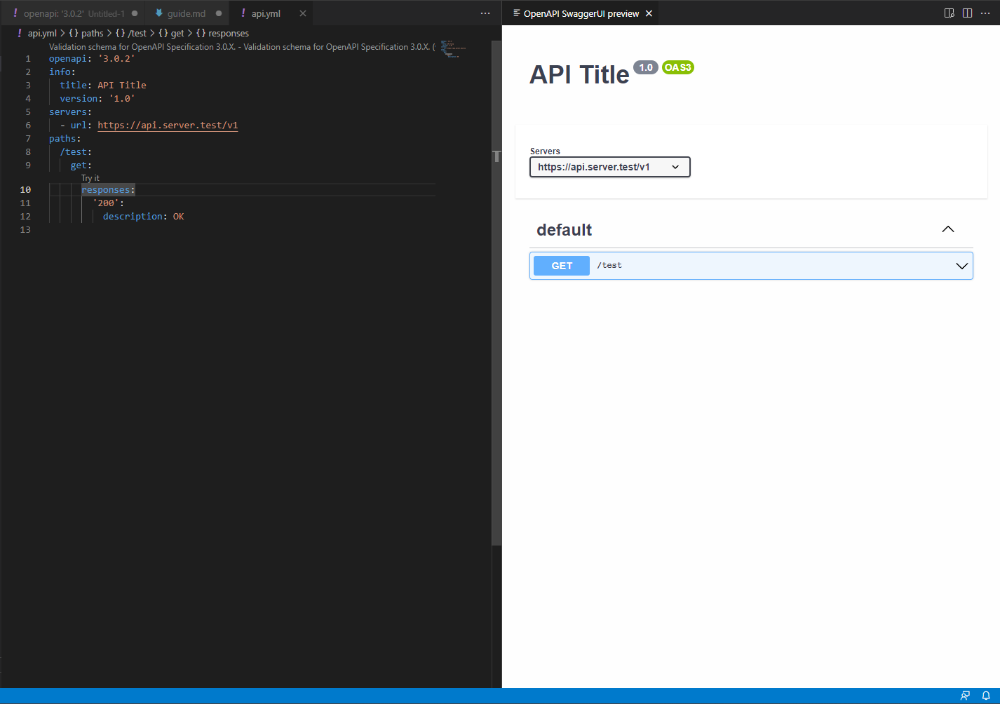

## Гайд как работать с репозиторием

1. Установить VS Code  
[Ссылка](https://code.visualstudio.com/)
2. В левой панели открыть Extensions  

3. Найти и установить "OpenAPI (Swagger) Editor"  

4. Появилась кнопка для работы с файлами openApi  

5. Рендер файла в SwaggerUI  

### Результат  
